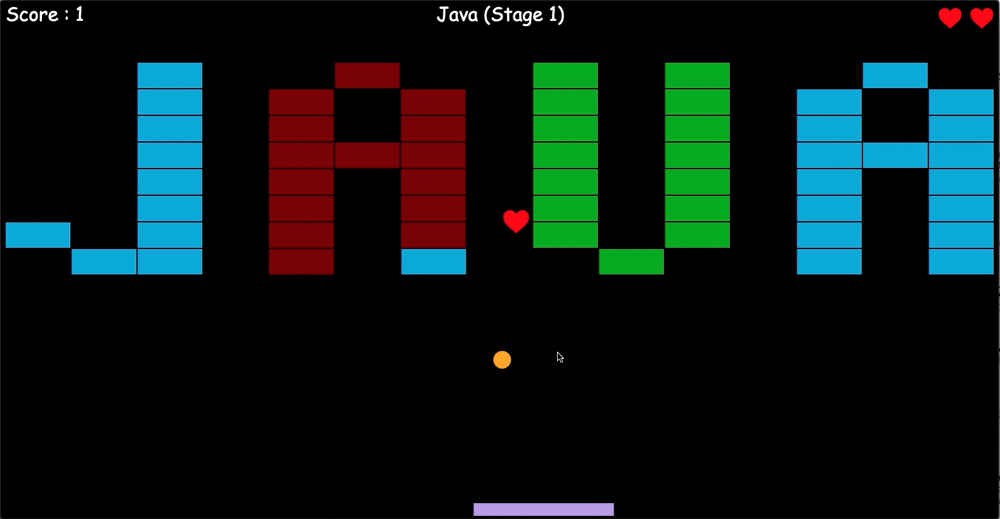

# DX-Ball

This is a simple clone of dx-ball arcade game.

## Gameplay

[](https://www.youtube.com/watch?v=bP4f78ZB80g)

## Installation

Clone the repository

```bash
git clone https://github.com/ratulSharker/dx-ball.git
```

## Run

### Run in docker

```bash
cd dx-ball
docker-compose up
```

### Run manually

Install the depdendency

```bash
cd dx-ball
npm install
```

Run the project

```bash
npm start
```

Access in browser http://localhost:8000

## Development

This project uses `nodemon` & `eslint` in development mode. To run in development mode

```bash
npm run dev
```

## Further Improvement

There are several [MDN Guideline](https://developer.mozilla.org/en-US/docs/Web/API/Canvas_API/Tutorial/Optimizing_canvas), read and improve performance. Following is a small list which can improve performance.

- [x] Disable canvas transperancy.
- [x] Separate canvas for Bat. Update only while mouse moved.
- [ ] Separate canvas for top score-stage_name-life. Update only while they updates.
- [x] Separate canvas for stage drawing. Update only while brick ball collide or stage updates.
- [x] Resizing images to size which they are drawn.
- [ ] Instead of clearing whole screen, only update the portion where the ball or power last time was present.
- [ ] Calculate collision and movement related tasks in a separate web worker, keep runloop only for rendering.
- [ ] Experimenting with `window.requestAnimationFrame`.
- [ ] Stage brick collision with ball can be more optimized by pre-considering ball inside the brick's bounding area or not.

Apart from these performance improvement, some more work can be done

- [x] Dockerize the whole application.
- [ ] Do form validation in `index.html` page.
- [ ] Show nicer toast instead of showing `window.alert('msg')`.
- [ ] Introduce inter-ball collision
- [ ] Introduce more power like shooting capabilities, fireball (blasting few neighbouring blocks), invincible ball (do not bounce back from bricks) etc.
- [ ] Store stages in the server. Serve stages via api.
- [ ] Prepare an UI for making more stages.
- [ ] Put a screen of available stages.
- [ ] Ability to pause in the middle of game & quit from game.
- [ ] Ability to control SFX and Gameplay volume.
